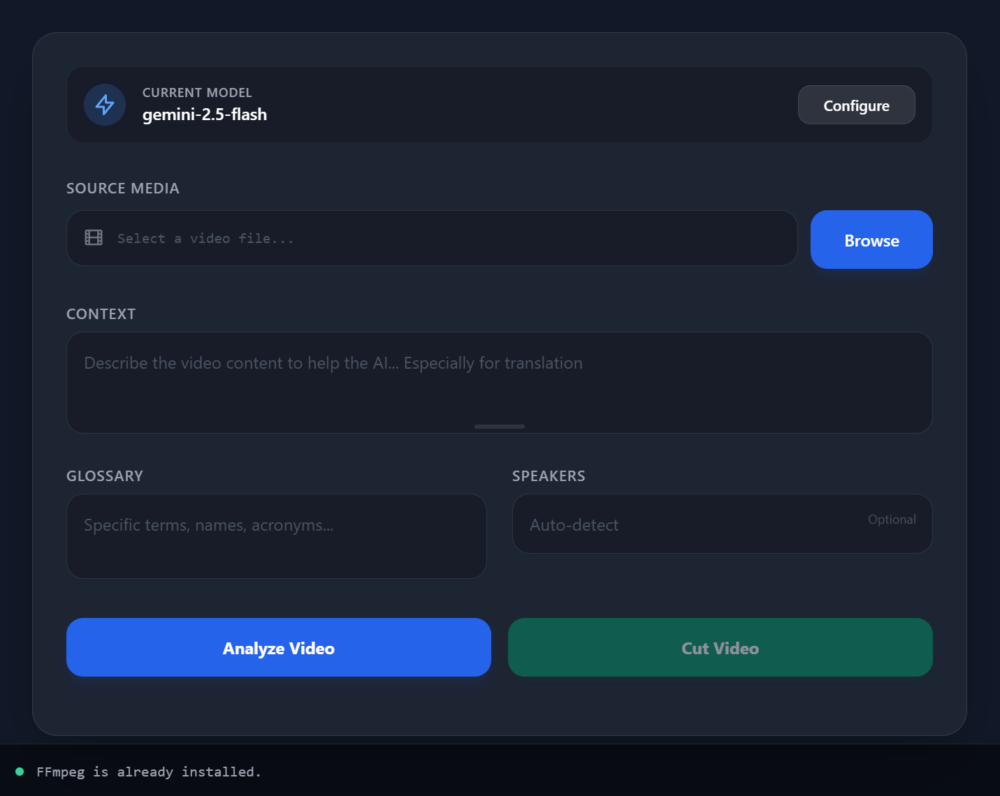
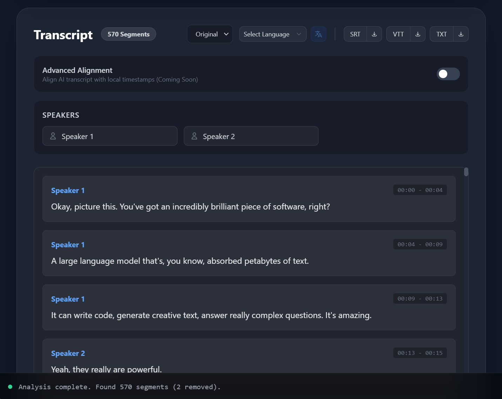

[](https://github.com/CypherNaught-0x/AI-Media-Analyse-and-Cut/actions/workflows/build.yml)

# AI Media Cutter

**AI Media Cutter** is a powerful, cross-platform desktop application designed to streamline video editing workflows using Artificial Intelligence. It leverages advanced LLMs (like Google Gemini and OpenAI) to transcribe, analyze, and edit video content intelligently.



## Key Features

*   **AI Transcription**: Automatically transcribe audio and video files with high accuracy.
*   **Text-Based Editing**: Edit videos by simply deleting text from the transcript. The video is automatically cut to match your text edits.
*   **Smart Filler Word Removal**: Toggle to automatically remove filler words (um, uh, like) and non-voice sounds for cleaner cuts.
*   **Advanced Editor**: Multi-select segments (Shift+Click) to merge or delete multiple parts at once.
*   **Real-time Preview**: Built-in video player that simulates the final cut by skipping deleted segments during playback.
*   **Viral Clips Generator**: AI analyzes your content to extract short, engaging clips suitable for TikTok, Shorts, or Reels. Includes "Smart Splicing" to combine non-contiguous relevant segments.
*   **Multi-Language Translation**: Translate transcripts into 15+ languages (Spanish, French, German, Japanese, etc.) while preserving original timestamps.
*   **Export Options**: Export subtitles (SRT, VTT, TXT) or the cut video file directly.
*   **Context-Aware**: Provide context and glossaries to the AI to improve transcription accuracy for technical terms or specific names.



## Installation

### Prerequisites
*   **FFmpeg**: The application requires FFmpeg for media processing. It will attempt to download it automatically on first run, or you can install it manually and add it to your PATH.

### Building from Source

1.  **Install Rust**: [https://rustup.rs/](https://rustup.rs/)
2.  **Install Node.js**: [https://nodejs.org/](https://nodejs.org/) (v18+)
3.  **Install pnpm**: `npm install -g pnpm`
4.  **Clone the repository**:
    ```bash
    git clone https://github.com/itemis/ai-media-cutter.git
    cd ai-media-cutter
    ```
5.  **Install dependencies**:
    ```bash
    pnpm install
    ```
6.  **Run in development mode**:
    ```bash
    pnpm tauri dev
    ```
7.  **Build for production**:
    ```bash
    pnpm tauri build
    ```

## Testing

The project includes a comprehensive test suite, including unit tests and integration tests.

### Running Tests

To run all tests (unit and integration):

```bash
cd src-tauri
cargo test
```

### Integration Tests

The integration tests include:
*   **Mock Tests**: Verify the application logic against simulated API responses.
*   **Real Pipeline Tests**: Run the full transcription, translation, and clip generation pipeline against a real API.

To run the **Real Pipeline Tests**, you need to configure the following environment variables (or create a `.env` file in `src-tauri/`):

```env
API_KEY=your_api_key
BASE_URL=https://generativelanguage.googleapis.com
API_MODEL=gemini-1.5-flash
```

If these variables are not set, the real pipeline tests will be skipped automatically.

## How to Use

1.  **Configure API**: 
    *   Click the "Configure" button or go to Settings.
    *   Enter your **Google Gemini API Key** (recommended, free tier available) or OpenAI API Key.
    *   You can use any OpenAI compatible endpoint that supports audio processing.
    *   Select your desired model.

2.  **Load Media**: 
    *   Click "Browse" to select a media file.
    *   Supports **Video** (MP4, MKV, MOV, AVI, WEBM) and **Audio** (MP3, WAV, AAC, FLAC, OGG).

3.  **Analyze**:
    *   (Optional) Enter **Context** (e.g., "A coding tutorial about Rust") to help the AI understand the topic.
    *   (Optional) Add **Glossary** terms for specific names or acronyms.
    *   (Optional) Toggle **Remove Filler Words** to automatically clean up "um", "uh", and non-voice sounds.
    *   Click **Analyze Media**. The AI will transcribe the content and identify speakers.

4.  **Edit**:
    *   **Remove Segments**: Delete lines from the transcript to remove those sections from the video.
    *   **Multi-Select**: Hold **Shift** and click multiple segments to select them. Use the floating toolbar to **Merge** or **Delete** them all at once.
    *   **Preview**: Use the built-in video player to preview your cuts. It automatically skips deleted segments during playback.
    *   **Silence Removal**: The app automatically filters out silent parts based on audio analysis (configurable minimum duration).
    *   **Rename Speakers**: Click on speaker names (e.g., "Speaker 1") to rename them globally.

5.  **Translate** (Optional): 
    *   Select a target language from the dropdown (e.g., 🇪🇸 Spanish).
    *   Click the Translate button.
    *   Switch between "Original" and translated versions to verify.

6.  **Generate Clips**: 
    *   Scroll down to the "Viral Clips Generator".
    *   Set your desired count and duration.
    *   Click **Generate Clips** to have the AI find the most engaging moments.

7.  **Export**:
    *   Click **Export Video** to render the final edited video based on your transcript.
    *   Use the **SRT / VTT / TXT** buttons to export subtitles.

## Tech Stack

*   **Frontend**: Vue 3, TypeScript, Tailwind CSS
*   **Backend**: Rust (Tauri), FFmpeg
*   **AI Integration**: Google Gemini API / OpenAI API

## License

MIT
