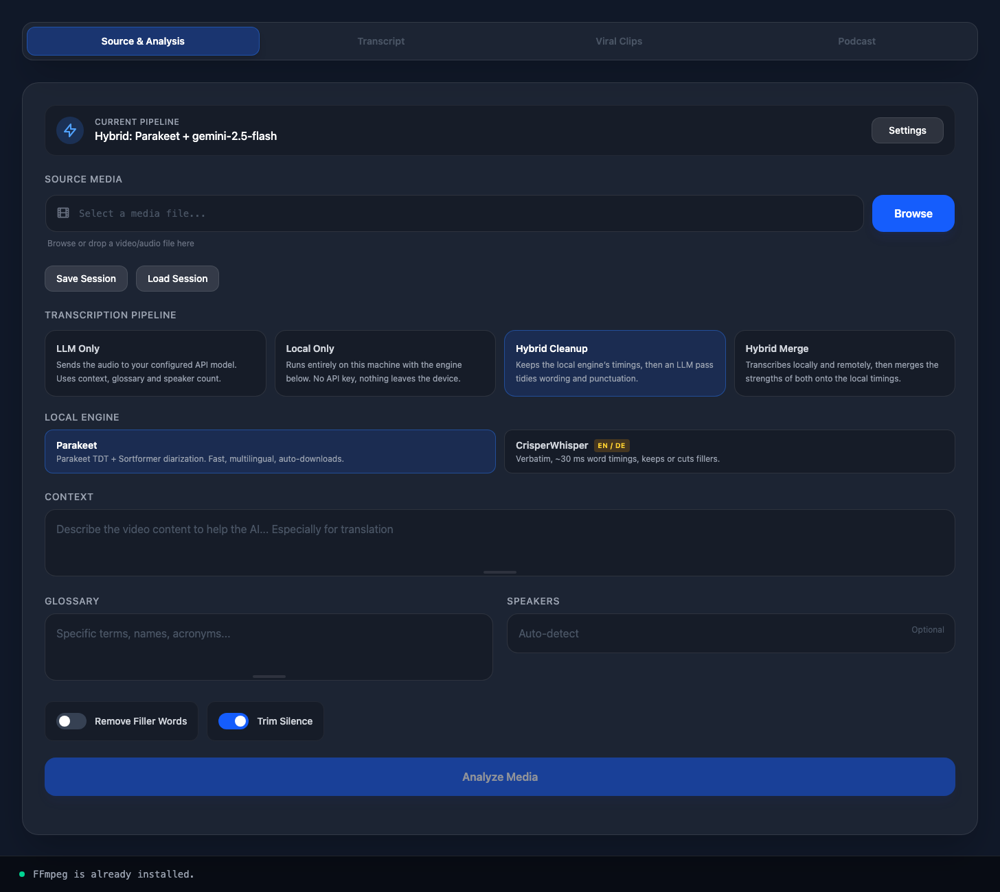
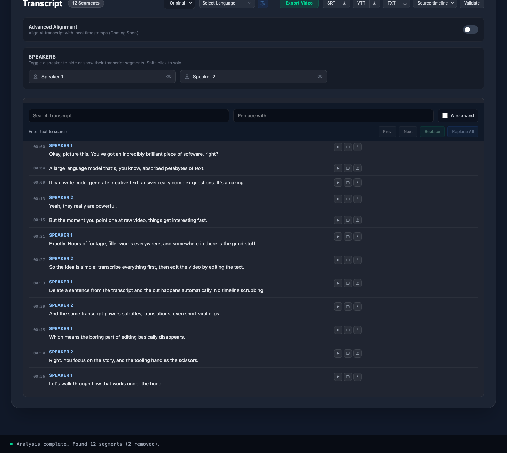

[](https://github.com/CypherNaught-0x/AI-Media-Analyse-and-Cut/actions/workflows/build.yml)

# AI Media Cutter

**AI Media Cutter** is a powerful, cross-platform desktop application designed to streamline video editing workflows using Artificial Intelligence. It leverages advanced LLMs (like Google Gemini and OpenAI) to transcribe, analyze, and edit video content intelligently.



## Key Features

*   **AI Transcription**: Automatically transcribe audio and video files with high accuracy.
*   **Verbatim Transcription (CrisperWhisper)**: Local, English/German-only engine that writes down every filler, stutter and vocal event with ~30 ms word timings — so "um"s can be cut out of the video, not just the text. See [Transcription Backends](#transcription-backends).
*   **Composable Pipelines**: Pick a pipeline (local, remote, or hybrid) and a local engine independently — every hybrid works with either engine. See [Transcription Backends](#transcription-backends).
*   **Text-Based Editing**: Edit videos by simply deleting text from the transcript. The video is automatically cut to match your text edits.
*   **Smart Filler Word Removal**: Toggle to automatically remove filler words (um, uh, like) and non-voice sounds for cleaner cuts.
*   **Advanced Editor**: Multi-select segments (Shift+Click) to merge or delete multiple parts at once.
*   **Real-time Preview**: Built-in video player that simulates the final cut by skipping deleted segments during playback.
*   **Transcript Blacklist Warnings**: Flag word-level matches from language-specific blacklist files directly in the transcript review UI.
*   **Viral Clips Generator**: AI analyzes your content to extract short, engaging clips suitable for TikTok, Shorts, or Reels. Includes "Smart Splicing" to combine non-contiguous relevant segments.
*   **Multi-Language Translation**: Translate transcripts into 15+ languages (Spanish, French, German, Japanese, etc.) while preserving original timestamps.
*   **Export Options**: Export subtitles (SRT, VTT, TXT) or the cut video file directly.
*   **Context-Aware**: Provide context and glossaries to the AI to improve transcription accuracy for technical terms or specific names.



## Installation

### Download & Install

You can download the latest version for Windows and MacOS from the releases page:

👉 **[Download Latest Release](https://github.com/CypherNaught-0x/AI-Media-Analyse-and-Cut/releases/latest)**

#### Windows

1. Download the `.msi` installer (e.g., `ai-media-cutter_x.x.x_x64_en-US.msi`).
2. Run the installer.
3. **SmartScreen Warning**: You may see a "Windows protected your PC" popup because the app is not signed.
   * Click **"More info"**.
   * Click **"Run anyway"**.

#### MacOS

1. Download the `.dmg` file (e.g., `ai-media-cutter_x.x.x_aarch64.dmg`). macOS builds are provided for Apple Silicon only.
2. Drag the app to your **Applications** folder.
3. If you get an "App is Damaged and can't be opened" error run `xattr -dr com.apple.quarantine /Applications/ai-media-cutter.app`
4. **"Unidentified Developer" Warning**:
   * **Right-click** the app in Finder and select **Open**.
   * Click **Open** in the dialog.
   * *Alternatively*: Go to **System Settings > Privacy & Security** and click **Open Anyway**.

### Prerequisites

*   **FFmpeg**: The application requires FFmpeg for media processing. It will attempt to download it automatically on first run, or you can install it manually and add it to your PATH.
*   **Python 3.10+** *(optional)*: Only needed for the CrisperWhisper backend, which the app installs into its own virtual environment on request. See [CrisperWhisper](#crisperwhisper).

### Building from Source

1.  **Install Rust**: [https://rustup.rs/](https://rustup.rs/)
2.  **Install Node.js**: [https://nodejs.org/](https://nodejs.org/) (v18+)
3.  **Install pnpm**: `npm install -g pnpm`
4.  **Clone the repository**:
    ```bash
    git clone https://github.com/CypherNaught-0x/AI-Media-Analyse-and-Cut.git
    cd AI-Media-Analyse-and-Cut
    ```
5.  **Install dependencies**:
    ```bash
    pnpm install
    ```
6.  **Run in development mode**:
    ```bash
    pnpm tauri dev
    ```
7.  **Build for production**:
    ```bash
    pnpm tauri build
    ```

#### Regenerating the preview screenshots

The preview images above are generated from the live UI (with mocked backend data). With [`just`](https://github.com/casey/just) installed, run:

```bash
just screenshots
```

## Testing

The project includes a comprehensive test suite, including unit tests and integration tests.

### Running Tests

To run all tests (unit and integration):

```bash
cd src-tauri
cargo test
```

### Integration Tests

The integration tests include:
*   **Mock Tests**: Verify the application logic against simulated API responses.
*   **Real Pipeline Tests**: Run the full transcription, translation, and clip generation pipeline against a real API.

To run the **Real Pipeline Tests**, you need to configure the environment variables `TEST_API_KEY`, `TEST_BASE_URL`, and `TEST_MODEL` (or create a `.env` file in `src-tauri/`). See `src-tauri/.env.example` for a template.


If these variables are not set, the real pipeline tests will be skipped automatically.

### CrisperWhisper Tests

The word-to-segment mapping is covered by ordinary unit tests that replay **real captured model
output** (`dev-resources/test-data/crisperwhisper_large_words.json`), so they need no Python
environment or model weights and run as part of `cargo test`.

Live tests that load the actual model live in `src-tauri/tests/crisper_integration.rs`. They
transcribe `dev-resources/test-data/test_podcast.m4a` and check the result against
`gold_standard_transcript.json` — word-timing monotonicity, verbatim filler capture, that
filler removal leaves a cuttable gap, and that `intended` mode is clean.

```bash
cd src-tauri
cargo test --test crisper_integration -- --nocapture
```

They use the environment the app manages, or `CRISPER_TEST_PYTHON=/path/to/venv/bin/python3`.
`CRISPER_TEST_MODEL` picks the size (default `small`, ~1 GB, rather than `large`'s ~2.2 GB).
**If no CrisperWhisper environment is present, every one of them skips**, so `cargo test` stays
green on a machine that has never set one up.

## How to Use

1.  **Configure API** *(not needed for the Local Only pipeline)*:
    *   Click the "Configure" button or go to Settings.
    *   Enter your **Google Gemini API Key** (recommended, free tier available) or OpenAI API Key.
    *   You can use any OpenAI compatible endpoint that supports audio processing.
    *   Select your desired model.

2.  **Load Media**: 
    *   Click "Browse" to select a media file.
    *   Supports **Video** (MP4, MKV, MOV, AVI, WEBM) and **Audio** (MP3, WAV, AAC, FLAC, OGG).

3.  **Analyze**:
    *   Pick a **Transcription Pipeline**, and — for anything other than *LLM Only* — a **Local Engine**. See [Transcription Backends](#transcription-backends).
    *   (Optional) Enter **Context** (e.g., "A coding tutorial about Rust") to help the AI understand the topic.
    *   (Optional) Add **Glossary** terms for specific names or acronyms.
    *   (Optional) Toggle **Remove Filler Words** to automatically clean up "um", "uh", and non-voice sounds.
    *   Click **Analyze Media**. The AI will transcribe the content and identify speakers.

    Context, glossary and speaker count are only sent to a remote model, so they are disabled
    for *Local Only*.

4.  **Edit**:
    *   **Remove Segments**: Delete lines from the transcript to remove those sections from the video.
    *   **Multi-Select**: Hold **Shift** and click multiple segments to select them. Use the floating toolbar to **Merge** or **Delete** them all at once.
    *   **Preview**: Use the built-in video player to preview your cuts. It automatically skips deleted segments during playback.
    *   **Silence Removal**: The app automatically filters out silent parts based on audio analysis (configurable minimum duration).
    *   **Rename Speakers**: Click on speaker names (e.g., "Speaker 1") to rename them globally.
    *   **Blacklist Warnings**: Review filter results now also include word-level blacklist matches. The transcript panel shows a summary, and each affected segment shows the matched word(s).

5.  **Translate** (Optional): 
    *   Select a target language from the dropdown (e.g., 🇪🇸 Spanish).
    *   Click the Translate button.
    *   Switch between "Original" and translated versions to verify.

6.  **Generate Clips**: 
    *   Scroll down to the "Viral Clips Generator".
    *   Set your desired count and duration.
    *   Click **Generate Clips** to have the AI find the most engaging moments.

7.  **Export**:
    *   Click **Export Video** to render the final edited video based on your transcript.
    *   Use the **SRT / VTT / TXT** buttons to export subtitles.
    *   Pick the timeline first: *Source timeline* matches the media you selected, *Cut timeline* re-times the cues for the `_cut` file (which contains only the transcript segments, so it starts at the first cue) and saves them as `<name>_cut.srt` next to it.

## Transcription Backends

Two independent choices, made on the analysis panel (or as defaults in Settings): **which
pipeline** runs, and **which local engine** it runs on.

### Pipeline

| Pipeline | Runs | Needs | Notes |
| --- | --- | --- | --- |
| **LLM Only** | Remote | API key | Sends the audio to your API model. Uses context, glossary and speaker count. |
| **Local Only** | Local | — | Runs entirely on this machine. Nothing leaves the device. |
| **Hybrid Cleanup** | Both | API key | Keeps the local engine's timings, then an LLM pass tidies wording and punctuation. |
| **Hybrid Merge** | Both | API key | Transcribes locally and remotely, then merges both onto the local timings. |

### Local engine

Used by every pipeline except **LLM Only** — including both hybrids.

| Engine | Needs | Notes |
| --- | --- | --- |
| **Parakeet** | — | Parakeet TDT + Sortformer diarization, word timestamps. Models auto-download. |
| **CrisperWhisper** | Python 3.10+ | Verbatim transcription with ~30 ms word timings. **English and German only**, non-commercial licence. |

The two axes are genuinely independent: the hybrid stages consume an opaque local transcript and
never know which engine produced it, so *Hybrid Merge + CrisperWhisper* is as valid a
combination as *Local Only + Parakeet*. Switching pipeline without changing the engine reuses
the cached local transcript instead of re-transcribing.

> Settings saved by earlier versions (which folded the engine into the pipeline as `parakeet` or
> `crisper`, and where the hybrids implied Parakeet) are migrated automatically on load.

### CrisperWhisper

[CrisperWhisper 2.0](https://huggingface.co/nyralabs/CrisperWhisper2.0_large) transcribes
*what was actually said* — every filler, repetition, stutter and vocal event — and times it to
the word. That is what makes it useful for cutting: because the app knows exactly where each
"um" is, it can remove it from the video and not just from the text.

**English and German only.** The model card is published for `en` and `de`; the language
picker offers nothing else. For other languages, use the Parakeet engine or the LLM Only
pipeline.

Options (Settings → CrisperWhisper Settings):

*   **Model size** — `large` (most accurate), `medium` (best tradeoff), `turbo` (fastest), `small`.
*   **Mode** — *Verbatim* keeps fillers and disfluencies (best for cutting); *Intended* returns
    the clean, readable version the speaker meant (best for subtitles).
*   **Remove Filler Words** (analysis panel) — drops `[UM]` / `[UH]`. In verbatim mode the
    segment is split at the filler, so the excised span is cut from the exported video too.
*   **Remove Vocal Events** — same treatment for `[laughter]`, `[breath]`, `[cough]`, `[sigh]`, …
*   **Identify Speakers** — adds Sortformer diarization; CrisperWhisper itself does not diarize.
*   **Advanced** — inference backend, device, precision and a Python interpreter override.

Word timings are always requested: the editor cuts on them, and the model adds no measurable
overhead for them.

#### Setup and cross-platform support

CrisperWhisper ships only PyTorch and CTranslate2 weights — there is no ONNX or GGML export —
so it cannot run through the ONNX runtime the Parakeet backend uses. It runs instead through the
official `crisperwhisper` Python package in a private environment the app creates and manages
under its app-data directory. Press **Set up** in Settings; the app builds the virtual
environment and installs the package (several GB, mostly PyTorch).

*   **Requirement**: Python 3.10 or newer on your system. Settings reports the interpreter it
    found and why it is unusable if it is not.
*   **macOS, Windows, Linux**: the portable PyTorch backend, which runs on CPU or GPU.
*   **Linux x86_64 + NVIDIA**: the CTranslate2 backend is roughly 4–5× faster and is selected
    automatically when installed; its wheels exist only for that platform.
*   Already have `crisperwhisper` installed? Point **Python Interpreter** at that environment
    and the app will use it instead of creating its own.

Note on `python3`: on macOS the default `python3` is the 3.9 command-line-tools build, which is
below the 3.10 floor. Setup therefore also looks for `python3.14` … `python3.10` (and the `py`
launcher on Windows), so a Homebrew or python.org install is found automatically.

Measured on an Apple M-series laptop, PyTorch backend, float32, 74 s of speech (the
`dev-resources/test-data` recording):

| Model | Device | Wall clock | Words |
| --- | --- | --- | --- |
| `small` | CPU | ~8 s | 157 |
| `small` | MPS | ~12 s | 157 |
| `large` | CPU | ~64 s | 130 |

Auto device selection stays on CPU on Apple Silicon deliberately: word timings require eager
attention, which measured *slower* on MPS than on CPU for identical output. **Apple GPU (MPS)**
is selectable under advanced options if you want to try it on your own hardware.

#### Known upstream issue: hallucination mitigation

`crisperwhisper` 2.0.1 imports `ctranslate2` at the top of its `hallucination` module, and the
PyTorch engine imports that module for its repair path. With only the portable
`[transformers]` extra installed, transcription would otherwise crash partway through with
`ModuleNotFoundError: No module named 'ctranslate2'`.

The app checks for this up front and continues with hallucination mitigation disabled, logging
a note in the progress feed rather than failing after minutes of inference. Everything else —
verbatim/intended modes, word timings, longform, filler removal — is unaffected. Installing
the CTranslate2 fork (`crisperwhisper[ct2]`, Linux x86_64 + NVIDIA) restores it.

Do **not** `pip install ctranslate2` to work around this: upstream CTranslate2 is not the
CrisperWhisper fork, and model loading fails with a missing-API error. The app detects this
case by checking for the fork's APIs and will not offer the `ct2` backend for an upstream
build.

> **Licensing**: the CrisperWhisper 2.0 weights are released under the Nyra Health
> **Non-Commercial Research License** — free for research and other non-commercial use, but
> commercial use requires a license from Nyra Health. The app itself remains MIT; this
> restriction applies to the downloaded model weights only.

## Transcript Blacklists

Language-specific blacklist files live in [`src/assets/transcript-blacklists/`](src/assets/transcript-blacklists/). Each file should use the language code as its filename, for example `de.txt`.

Rules:

*   One candidate term per line.
*   Matching is word-level only, not substring-based.
*   Leading and trailing punctuation is ignored during matching.
*   Multi-word entries are ignored by the matcher.

To extend blacklist coverage for another language, add a new `xx.txt` file in that folder. The frontend auto-discovers all available blacklist files at build time.

## Tech Stack

*   **Frontend**: Vue 3, TypeScript, Tailwind CSS
*   **Backend**: Rust (Tauri), FFmpeg
*   **AI Integration**: Google Gemini API / OpenAI API

## License

MIT
